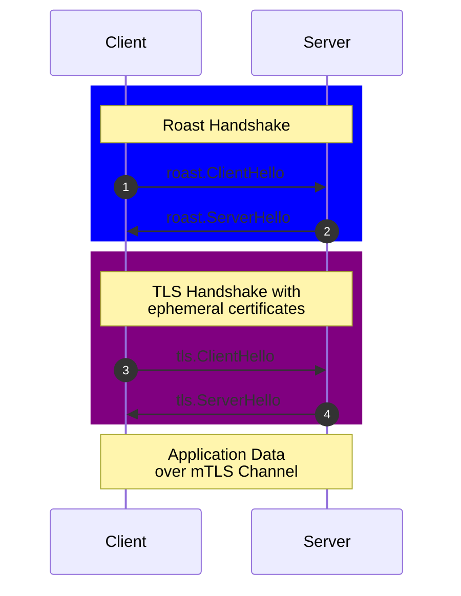
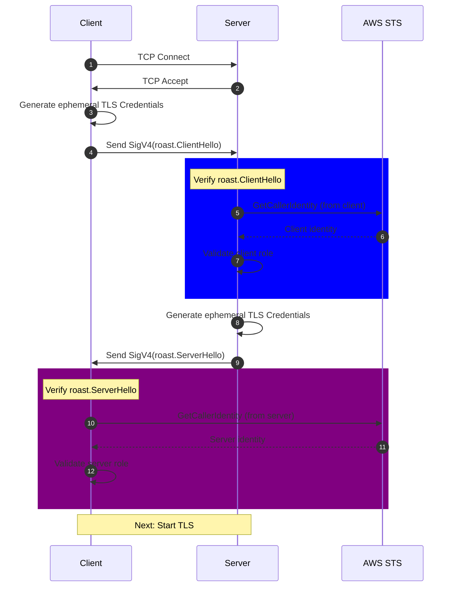

# Roast: Simplified mTLS for AWS

> [!WARNING]
> Roast is still under fairly active development. Please don't use it, but if this this sounds interesting to you feel free, to reach out :D

## Overview

Roast (`[Ro]le[A]WS[S]ignature[T]LS`) is a Go library that simplifies mutual TLS (mTLS) authentication by leveraging your existing AWS IAM identities instead of traditional Certificate Authorities (CAs). It provides drop-in replacements for standard Go networking primitives.

Roast aims to give you a simpler approach to programmatic service authentication (AuthN), authorization (AuthZ), and confidentiality by building on infrastructure you likely already have.

## Why?

Traditional mTLS implementations often involve operational challenges:

- **CA infrastructure complexity** - Setting up and managing certificate authorities can be complex and time-consuming
- **Additional operational overhead** - Another service to run, monitor, and maintain  
- **Parallel identity systems** - Managing certificates separately from your existing AWS IAM setup
- **Key management** - Handling certificate rotation, revocation, and distribution

Roast takes a different approach by building on AWS's existing identity infrastructure. Since you're likely already using AWS IAM for identity management, why not use it for service-to-service authentication too?

This approach aims to provide:
- **Reduced operational overhead** - Fewer additional services to manage
- **Automatic key rotation** - Fresh ephemeral certificates for each connection
- **Familiar identity model** - Use your existing IAM roles for service authentication
- **Simpler infrastructure** - Build on what you already have

## How to use

In the most common case, all you need to configure is which roles you expect to find on the other side of your connection.

For clients, that means which AWS Role(s) you expect your server to have:

```go
func client(serverAddr string) {
    allowedRoles := []arn.ARN{mustParseARN("arn:aws:iam::123456789012:role/Client")}

    rd, err := roast.NewDialer(allowedRoles)
    if err != nil {
        log.Fatal(err)
    }

    conn, err := rd.DialContext("tcp", serverAddr)
    if err != nil {
        log.Fatal(err)
    }

    handleConnection(conn)
}
```

For servers that means which AWS Role(s) you expect your clients to have:

```go
func server(rawL net.Listener) {
    allowedRoles := []arn.ARN{mustParseARN("arn:aws:iam::123456789012:role/Client")}
    rl, err := roast.NewListener(rawL, allowedRoles)
    if err != nil {
        log.Fatal(err)
    }

    for {
        conn, err := rl.Accept()
        if err != nil {
            log.Fatal(err)
        }
        go handleConnection(conn)
    }
}
```

If you need to make additional customization for how to verify peer's identities, you can do so by replacing the Listner or Dialer's `gcisigner.Verifier`'s `SourceVerifier`

### HTTP using `rhttp2`

There's a pre-built integration for using Roast with HTTP called `roast/rhttp2`. As its name implies it enforces the use of HTTP 2, this is preferable to directly integrating with `net/http` each Roast connection introduces an additional round trip to to setup a connection and HTTP 1.x many cases where it tears down connections unnecessarily.

Why? `net/http` has a very strong binding to only negotiating HTTP2 connections on `*tls.Conn` connections. The options I've seen to work around that don't seem great, so punting on it for now. Ideas welcome!

<details>
<summary>http_server.go</summary>

```go
package main

import (
	"fmt"
	"log"
	"net"
	"net/http"

	"github.com/aws/aws-sdk-go-v2/aws/arn"
	"github.com/thomasdesr/roast"
	"github.com/thomasdesr/roast/rhttp2"
)

func main() {
	listener, err := net.Listen("tcp", "127.0.0.1:8443")
	if err != nil {
		log.Fatal(err)
	}

	allowedRoles := []arn.ARN{arn.ARN{Resource: "role/ClientRole"}}
	srv := &rhttp2.Server{
		Server: &http.Server{
			Handler: http.HandlerFunc(func(w http.ResponseWriter, r *http.Request) {
				peer := roast.PeerMetadataFromContext(r.Context())
				fmt.Fprintf(w, "Hello, %s!\n", peer.Role.Resource)
				fmt.Printf("Server: Sent greeting to %s\n", peer.Role.Resource)
			}),
		},
		AllowedRoles: allowedRoles,
	}

	log.Println("Server listening on", listener.Addr())
	if err := srv.Serve(listener); err != nil {
		log.Fatal("serve error:", err)
	}
}
```

</details>

<details>
<summary>http_client.go</summary>

```go
package main

import (
	"fmt"
	"io"
	"log"
	"net/http"

	"github.com/aws/aws-sdk-go-v2/aws/arn"
	"github.com/thomasdesr/roast/rhttp2"
)

func main() {
	allowedRoles := []arn.ARN{arn.ARN{Resource: "role/ServerRole"}}
	client, err := rhttp2.Client(allowedRoles)
	if err != nil {
		log.Fatal(err)
	}

	resp, err := client.Get("https://127.0.0.1:8443")
	if err != nil {
		log.Fatal(err)
	}
	defer resp.Body.Close()

	body, err := io.ReadAll(resp.Body)
	if err != nil {
		log.Fatal(err)
	}

	fmt.Printf("Client received: %s", body)
}
```

</details>

### GRPC using `rgrpc`

TKTK

## How it works

TKTK: Mark this as a note:

> This section's intended audience is not expected to be intimently familiar with the details of AWS. But you should ideally have some familiarity with what an AWS Role is.

tl;dr

1. Using SigV4 signed sts.GetCallerIdentity requests to provide a proof of
   identity w/ an attached emphemeral CA public key
2. Generate emphermal client & server TLS certs and use them to establish an mTLS verified connections.

High-level walkthrough (see the diagrams for a more detailed breakdown of the protocol):

1. Client initiates a connection to the server
2. Both parties perform a Roast handshake:
   - This is Generate and exchange signed hello messages
   - Verify signatures and validate peer identities using AWS STS
   - Confirm peer roles are allowed to connect
3. Upon successful handshake, both sides generate ephemeral certificates
4. A standard TLS handshake is performed using these certificates
5. A secure TLS channel is established for application data

### SigV4 + GetCallerIdentity == `Sign(🥳)`

AWS's primary authentication mechanism (SigV4) [TKTK:AWS docs link] is probably one of the best pieces of technology in widespread use today. As an authentication mechanism it goes far beyond simple identity tokens (aka Bearer Tokens). It ensures that AWS is able to validate not only which identity sent the request, but also the integrity of the entire requests, including the HTTP method, headers, and body.

AWS has an API called `GetCallerIdentity` which allows anyone with AWS Credentials to ask "Who am I?" [TKTK: Link to GCI docs?]. This is normally used by humans for debugging.

However we can combine these two together by:

- Constructing a GetCallerIdentity request with a body containing the arbitrary bytes we want to "sign".
- Using an AWS SDK and available AWS credentials to generate a signature for this request.

The signature guarantees both the sender's AWS identity and the integrity of the message. Meaning we can pass this "signed request" to anyone else who can make a network request to AWSand they can verify it came from "us" and that no one has tampered with the data we're sharing

This approach turns AWS credentials into a generic bytes signing method, allowing an integrity and authenticated message exchange without involving additional "key distribution problems" beyond the one you've already solved by using AWS's identity system.

### Connection Sequence Diagrams

<details>
<summary>Full Setup Sequence</summary>



</details>

<details>
<summary>Roast Handshake</summary>



</details>

## [WIP] Design Principles

0. $PRINCIPAL

- Why & Examples of choices

1. Err on the side of caution

- Case: Every TCP Connection gets its own TLS key pair
  -> Attackers can replay any observed handshake parameters. If every connection gets its own key pair, its harder for an attacker to have a predictable target. Also it means stolen values aren't valuable.
  ->

## Security Model

Roast uses a two-step authentication process:

1. An exchange of signed GetCallerIdentity payloads:

   - Verifies the identity of both client and server using their AWS Identity
   - Ensures that only authorized IAM roles can establish connections

2. TLS with ephemeral certificates:
   - As a part of identity verification, each side of the roast handshake generates a per-connection certificates locally.
   - These certificates will use Go's stdlib's TLSlibrary

Security considerations:

- Roast critically depends on your use of AWS IAM. If a malicious party is able to access IAM Credentials for a role in the allowed list, they will be able to be a party to your communications.
- Ephemeral, never used again certificates aim to reduce the risk of compromised keys.
- After the Roast Handshake, all future communcations should use latest available TLS (1.3 as of writing).

TODO: Security issues in this space the author was aware of:

- HC Vault + k8s-aws-authenticator GCI failures
