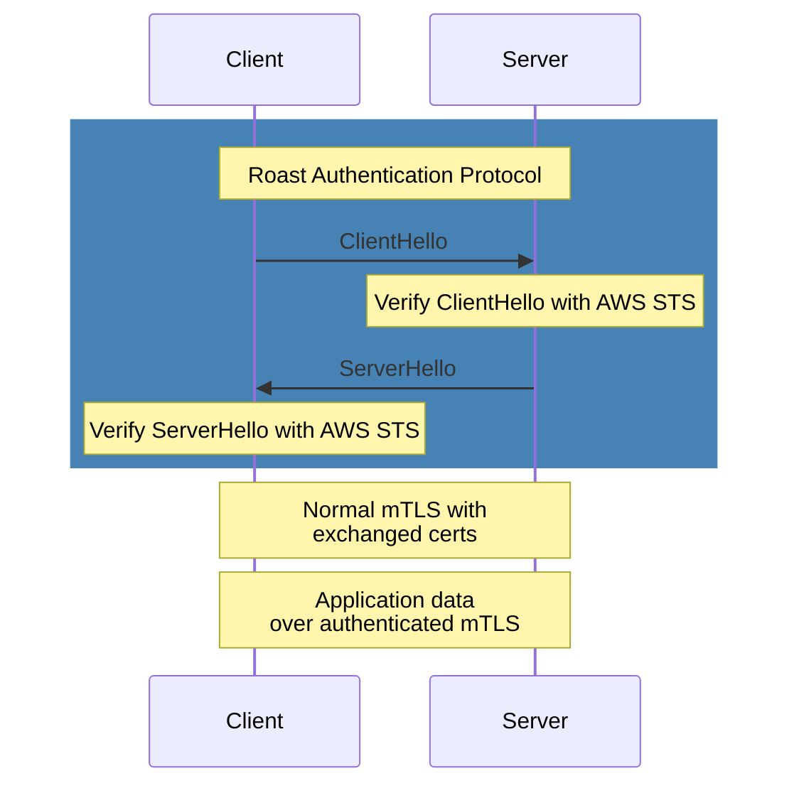
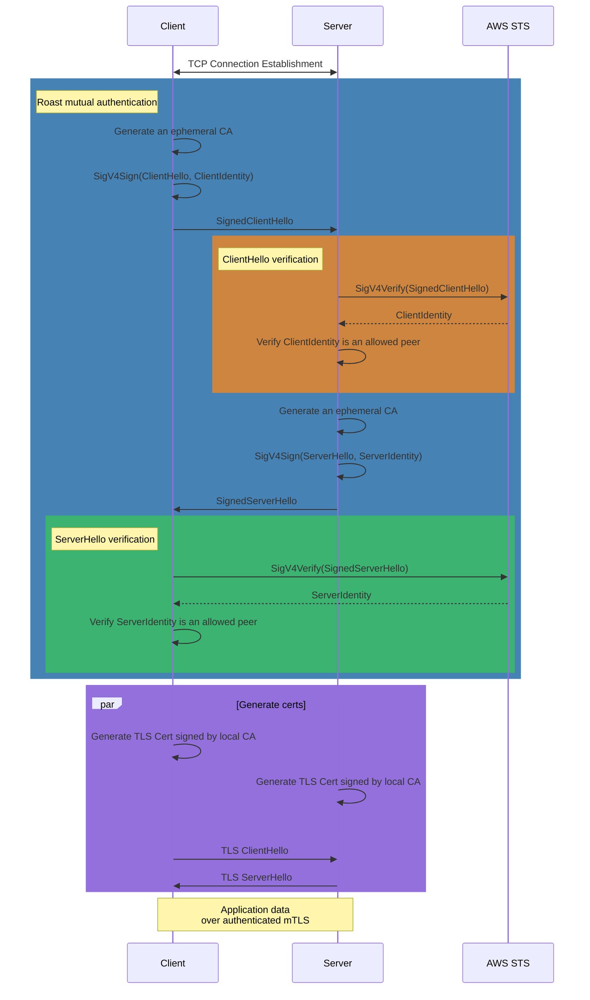

# How Roast Works

> [!NOTE]
> This section assumes some familiarity with AWS IAM roles but not intimate knowledge of AWS internals.

For a quick overview and getting started, see the [README](../README.md). For security considerations and limitations, see [SECURITY.md](../SECURITY.md).

## Protocol Overview

**tl;dr:**

1. Using SigV4 signed `sts.GetCallerIdentity` requests to provide a proof of
   identity with an attached ephemeral CA public key
2. Generate ephemeral client & server TLS certificates and use them to establish an mTLS verified connection

## High-Level Walkthrough

1. Client initiates a connection to the server
2. Both parties perform a Roast handshake:
   - Generate and exchange signed hello messages
   - Verify signatures and validate peer identities using AWS STS
   - Confirm peer roles are allowed to connect
3. Upon successful handshake, each side generates their ephemeral certificates
4. A standard Go `crypto/tls` handshake is performed using these certificates
5. TLS channel is established for application data and the `net.Conn` is
   returned for the caller to use

## SigV4 + GetCallerIdentity == `Sign(🥳)`

AWS's primary authentication mechanism (SigV4) is one of the most robust pieces
of authentication technology in widespread use today. As an authentication
mechanism, it provides significantly more than a simple identity tokens (a.k.a.
Bearer Tokens). It ensures that AWS can validate not only which identity sent
the request, but also the integrity of the entire request, including the HTTP
method, chosen headers, and body.

AWS has an API called `GetCallerIdentity` which allows anyone with AWS
Credentials to ask "Who am I?". This is normally used by humans for debugging.

However, we can combine these two together by:

- Constructing a GetCallerIdentity request with a body containing the arbitrary
  bytes we want to "sign"
- Using an AWS SDK and available AWS credentials to generate a signature for
  this request

The signature guarantees both the sender's AWS identity and the integrity of the
message. This means we can pass this "signed request" to anyone else who can
make a network request to AWS, and they can verify it came from "us" and that no
one has tampered with the data we're sharing.

This approach turns AWS credentials into a generic bytes signing method,
allowing integrity-assured and authenticated message exchange without
introducing additional "key distribution problems" beyond the one you've already
solved by using AWS's identity system.

## Connection Sequence Diagrams

### Full Setup Sequence

This is a high level diagram showing a summarized description of the Roast
connection setup sequence.

### Roast Handshake Detail

This diagram provides a step-by-step walkthrough of the Roast handshake.

